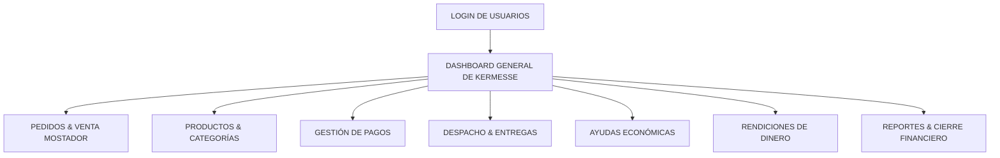

# Sistema de Gestión de Kermesse
## Documento de Arquitectura Funcional y Modelo de Datos (Google Sheets)

**Versión:** 2.0  
**Fecha:** 2026-09-15  

---

# 1. Objetivo General

Desarrollar un sistema integral de administración de Kermesse con base de datos en Google Sheets y backend en Google Apps Script, garantizando:

1. Digitalización completa del ciclo operativo: productos, ventas, ayudas económicas, entregas por repartidores y rendiciones.
2. Desacoplamiento estricto entre **Estado de Pedido**, **Estado de Pago**, **Métodos de Entrega** y **Rendición de Dinero**.
3. Control financiero preciso al finalizar la Kermesse: recaudación por categorías (Platos, Bebidas, Postres, Combos, Otros), ayudas económicas independientes, pagos por Efectivo vs QR y auditoría de discrepancias.

---

# 2. Arquitectura de Navegación y Flujo

---

# 3. Estructura de Base de Datos en Google Sheets (17 Pestañas)

### 1. Pestaña `usuarios`
- `id`: USR000001
- `nombre`: Nombre completo
- `correo`: Correo electrónico
- `password`: Contraseña
- `rol`: `Administrador`, `Cocina`, `Repartidor`, `Cajero`
- `activo`: `true` / `false`
- `created_at`
- `updated_at`

### 2. Pestaña `tipos_pago`
- `id`: TPG000001
- `codigo`: `EFECTIVO`, `QR`
- `nombre`: Efectivo, QR
- `activo`: `true`
- `created_at`, `updated_at`

### 3. Pestaña `categorias_producto`
- `id`: CAT000001
- `codigo`: `PLATO`, `BEBIDA`, `POSTRE`, `COMBO`, `OTRO`
- `nombre`: Platos, Bebidas, Postres, Combos, Otros
- `descripcion`: Descripción funcional
- `activo`: `true`
- `created_at`, `updated_at`

### 4. Pestaña `productos`
- `id`: PRO000001
- `categoria_id`: Referencia a `categorias_producto.id`
- `codigo`: PLT-001
- `nombre`: Pollo al horno
- `descripcion`: Descripción del plato
- `tipo`: `PLATO`, `BEBIDA`, `POSTRE`, `COMBO`, `OTRO`
- `precio`: Precio unitario (DECIMAL)
- `stock_control`: `true` / `false`
- `stock`: Cantidad en inventario
- `activo`: `true`
- `created_at`, `updated_at`

### 5. Pestaña `clientes`
- `id`: CLI000001
- `nombre`: Nombre del cliente / persona
- `telefono`: Celular (Default: 0)
- `direccion`: Dirección de entrega
- `latitud`: Coordenada latitud para mapa
- `longitud`: Coordenada longitud para mapa
- `observaciones`: Notas
- `activo`: `true`
- `created_at`, `updated_at`

### 6. Pestaña `estados_pedido`
- `id`: EST000001
- `codigo`: `RESERVADO`, `CONFIRMADO`, `EN_PREPARACION`, `LISTO_DESPACHO`, `ASIGNADO`, `EN_CAMINO`, `RECOJO_SITIO`, `PARA_LLEVAR`, `ENTREGADO`, `CANCELADO`
- `nombre`: Nombre descriptivo
- `color`: Clase o badge
- `activo`: `true`
- `created_at`, `updated_at`

### 7. Pestaña `metodos_entrega`
- `id`: MET000001
- `codigo`: `RECOJO_SITIO`, `PARA_LLEVAR`, `DOMICILIO`
- `nombre`: Método de entrega
- `activo`: `true`
- `created_at`, `updated_at`

### 8. Pestaña `pedidos`
- `id`: PED000001
- `numero`: KER-000001
- `cliente_id`: CLI000001
- `estado_pedido_id`: EST000001
- `metodo_entrega_id`: MET000001
- `subtotal`: Subtotal calculado
- `descuento`: Descuento global
- `total`: Total final a cobrar
- `observaciones`: Comentarios adicionales
- `direccion_entrega`: Dirección exacta de entrega
- `latitud`: Coordenada latitud para Google Maps
- `longitud`: Coordenada longitud para Google Maps
- `fecha_pedido`: YYYY-MM-DD
- `usuario_registro_id`: USR000001
- `created_at`, `updated_at`

### 9. Pestaña `pedido_detalles`
- `id`: DET000001
- `pedido_id`: PED000001
- `producto_id`: PRO000001
- `cantidad`: Cantidad (ENTEROS / DECIMAL)
- `precio_unitario`: Precio al momento de la venta (Histórico)
- `descuento`: Descuento por ítem
- `subtotal`: Subtotal de la línea
- `observaciones`: Comentarios por plato
- `created_at`, `updated_at`

### 10. Pestaña `pagos`
- `id`: PAG000001
- `pedido_id`: PED000001
- `tipo_pago_id`: TPG000001 (`EFECTIVO` / `QR`)
- `monto`: Monto cobrado (DECIMAL)
- `referencia`: N° de comprobante o transacción QR
- `fecha_pago`: Timestamp del pago
- `usuario_id`: Usuario que registró el cobro
- `estado`: `REGISTRADO`, `ANULADO`, `DEVUELTO`
- `observaciones`: Notas sobre el pago
- `created_at`, `updated_at`

### 11. Pestaña `entregas`
- `id`: ENT000001
- `pedido_id`: PED000001
- `responsable_id`: USR000003 (Repartidor)
- `fecha_asignacion`: Timestamp de asignación
- `fecha_salida`: Timestamp cuando sale en camino
- `fecha_entrega`: Timestamp de entrega efectiva
- `estado`: `ASIGNADO`, `EN_CAMINO`, `ENTREGADO`
- `observaciones`: Observaciones
- `recibido_por`: Nombre de la persona que recibió
- `created_at`, `updated_at`

### 12. Pestaña `ayudas_economicas`
- `id`: AYU000001
- `persona`: Nombre del colaborador / padrino
- `monto`: Monto donado (DECIMAL)
- `tipo_pago_id`: `EFECTIVO` / `QR`
- `referencia`: N° de transacción QR
- `fecha`: YYYY-MM-DD
- `usuario_id`: Usuario que registró la donación
- `observaciones`: Propósito u notas
- `created_at`, `updated_at`

### 13. Pestaña `pedido_historial`
- `id`: HST000001
- `pedido_id`: PED000001
- `estado_anterior_id`: Estado previo
- `estado_nuevo_id`: Estado posterior
- `usuario_id`: Usuario que ejecutó la transición
- `fecha`: Timestamp del evento
- `observaciones`: Explicación del cambio

### 14. Pestaña `rendiciones`
- `id`: RND000001
- `numero_rendicion`: RND-00001
- `responsable_id`: Repartidor (USR000003)
- `fecha_inicio`, `fecha_fin`: Rango del turno
- `pedidos_entregados_count`: N° de pedidos en la rendición
- `total_esperado`: Suma de total de pedidos entregados
- `efectivo_esperado`, `qr_esperado`: Montos esperados por método
- `efectivo_declarado`, `qr_declarado`, `total_declarado`: Montos entregados físicamente
- `diferencia_efectivo`, `diferencia_qr`, `diferencia_total`: Faltantes / Sobrantes
- `estado`: `ABIERTA`, `EN_REVISION`, `APROBADA`, `OBSERVADA`, `CERRADA`
- `observaciones`: Justificación de diferencias
- `usuario_cierre_id`: Administrador que aprueba
- `fecha_aprobacion`, `created_at`, `updated_at`

### 15. Pestaña `rendicion_detalles`
- `id`: RDT000001
- `rendicion_id`: RND000001
- `pedido_id`: PED000001
- `monto_esperado`: Total pedido
- `monto_cobrado`: Total pagado
- `diferencia`: Diferencia por pedido
- `observaciones`: Notas

### 16. Pestaña `permisos`
- `id`, `codigo`, `nombre`, `modulo`, `descripcion`

### 17. Pestaña `kermesse_cierre`
- Auditoría definitiva y resumen de caja al finalizar el evento.

---

# 4. Reglas de Negocio Clave

1. **Estado Dinámico de Pago**:
   $$\text{Total Pagado} = \sum \text{Pagos (Estado = 'REGISTRADO')}$$
   - Si $\text{Total Pagado} = 0 \rightarrow$ **PENDIENTE**
   - Si $0 < \text{Total Pagado} < \text{Total Pedido} \rightarrow$ **PAGO PARCIAL**
   - Si $\text{Total Pagado} \ge \text{Total Pedido} \rightarrow$ **PAGADO**

2. **Diferencias de Rendición**:
   $$\text{Diferencia} = \text{Total Declarado} - \text{Total Esperado}$$
   - Si $\text{Diferencia} = 0 \rightarrow$ **APROBADA**
   - Si $\text{Diferencia} \neq 0 \rightarrow$ **OBSERVADA**

3. **Separación de Ayudas Económicas**:
   Las ayudas económicas no afectan las ventas de platos o productos y se presentan por separado en el Reporte Cierre de Kermesse.
